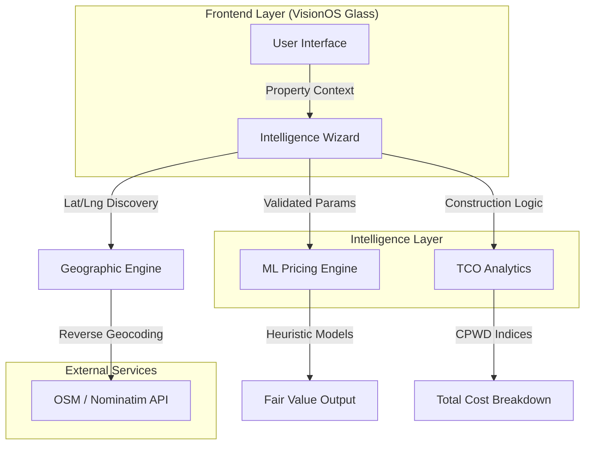

# PropIQ — Real Estate Decision Intelligence 🏠🧠

PropIQ is a high-fidelity **Real Estate Intelligence Engine** designed to replace traditional brokerage guesswork with data-backed, machine learning-driven property valuation and Total Cost of Ownership (TCO) analytics. 

Built with a state-of-the-art **VisionOS-inspired Glassmorphic UI**, PropIQ offers a premium, immersive experience for Indian home buyers, investors, and banks to analyze property values with surgical precision.

---

## 🏛️ Architectural Structure

PropIQ follows a decoupled, intelligence-first architecture, separating the high-fidelity user interface from the heavy mathematical heuristics and geocoding engines.



---

## 🛠️ Tech Stack & Technologies

### **Frontend Architecture**
- **Core Framework**: React 18+ with Vite for ultra-fast HMR and build performance.
- **Styling Engine**: Vanilla CSS with **Apple Glassmorphism (VisionOS)** design principles—utilizing deep backdrop blurs, saturation boosters, and high-translucency overlays.
- **State Management**: Localized component state with strict sanitization to prevent cross-property data contamination.
- **Icons**: Lucide React for consistent, minimal iconography.

### **Intelligence & Mapping**
- **Geospatial**: Leaflet.js with custom **Arctic Cyan & Teal** tile filtering for a professional "Road Map" look.
- **Geocoding**: Nominatim OpenStreetMap API for boundary-accurate Indian location detection.
- **Math Engine**: Custom heuristic regression models (`mlEngine.js`) simulating XGBoost behaviors for instant client-side valuation.

### **Backend (Phase 2 Integration)**
- **API**: Python FastAPI microservices.
- **Data Science**: XGBoost & Scikit-Learn models trained on scraped regional real estate datasets.

---

## 🚀 Key Working Principles

### **1. VisionOS High-Fidelity Intake**
The intake process is not a simple form; it's an **Intelligence Wizard**.
- **Dynamic Logic**: The wizard morphs its requirements based on property type (e.g., Plot vs. Penthouse).
- **Glassmorphic Feedback**: Real-time visual cues and premium blur effects guide the user through complex data entry.

### **2. Geographic "National Focus" Engine**
PropIQ implements a strict **India-Centric Mapping** philosophy.
- **Boundary Masking**: Utilizing CSS backdrop-filter masks, the system blurs all regions outside the Indian border, focusing the intelligence strictly on the domestic market.
- **Neural Outline**: A pulsing neon-cyan border defines the operational territory, ensuring geographic data integrity.

### **3. Total Cost of Ownership (TCO) Analytics**
Unlike basic price calculators, PropIQ provides a **True Cost Breakdown**:
- Raw Land/Construction Value.
- State-specific Stamp Duty & Registry.
- GST and Hidden Society Maintenance overheads.

---

## ⚙️ Development Setup

1. **Clone & Install**:
   ```bash
   git clone https://github.com/TheRaviHub/propiq-real-estate.git
   cd propiq-real-estate
   npm install
   ```
2. **Launch Intelligence Engine**:
   ```bash
   npm run dev
   ```
3. **Build for Production**:
   ```bash
   npm run build
   ```

---

## 🗺️ Roadmap
- [x] **Phase 1**: VisionOS UI & Frontend Heuristic Engine.
- [ ] **Phase 2**: Python ML Backend & XGBoost Model Integration.
- [ ] **Phase 3**: Real-time Marketplace Data Scraping (MagicBricks/99acres).
- [ ] **Phase 4**: Bank Collateral Risk Scoring Dashboard.

---
*PropIQ — Built for the next generation of Indian Real Estate.*
